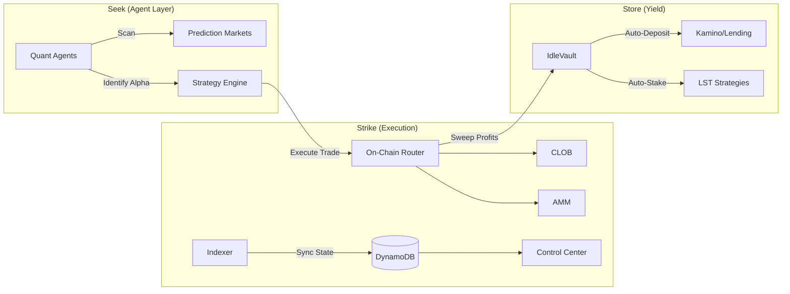

# Integration Roadmap: Stratavault (Seek, Strike, Store)

This roadmap integrates the AI Agent engine ("Seek"), the Execution Layer ("Strike"), and the Yield Automation ("Store") into a cohesive system.

## Phase 1: Seek — The Agentic Eye (Complete)
**Objective**: Establish the mathematical and data foundation for identifying alpha.
- `development-specs/MATHEMATICAL_FRAMEWORK.md`: Defines Discretization & On-chain Approximations.
- **Status**: Complete. The "Brain" knows what to look for.

## Phase 2: Strike — Market & Execution Infrastructure (In Progress)
**Objective**: Build the machinery for the Agents to execute trades with precision.
- **Indexer** (`INDEXER_SKELETON.md`):
    - [ ] Real-time log subscription for new markets, pricing, orderbooks, and trade history.
    - [ ] Idempotent upserts to DynamoDB to ensure data integrity.
- **Execution Programs**:
    - [ ] `market_factory`: The forge for new opportunities.
    - [ ] `router`: The central nervous system connecting Agents to Liquidity.
    - [ ] `clob` / `amm`: The venues for "Strike".

## Phase 3: Store — Yield Automation & Vaults
**Objective**: Ensure capital is never idle. "Profit to Yield" Loop.
- **Vault Contracts**:
    - [ ] Implement `IdleVaults`: Smart contracts that accept profit sweeps.
    - [ ] Integrate Kamino/Save/Sanctum adapters for auto-depositing.
- **Agent Triggers**:
    - [ ] Logic for Agents to "Sweep" profits post-trade resolution.

## Phase 4: Interface — The Control Center
**Objective**: Give users visibility and control over their Agents.
- **Generative UI (`WEB_ENHANCEMENTS_PLAN.md`)**:
    - [ ] "Copilot Kit" integration: Users define risk/reward profiles via chat.
    - [ ] Dashboard: Visualizing "Seek" (Active Bets) vs "Store" (Yielding Capital).
- **Environment**:
    - [ ] Feature Flags: `NEXT_PUBLIC_ONCHAIN=false` for simulation mode.

## Phase 5: Resolution & Oracle reliability
**Objective**: The source of truth.
- **Oracle Resolution (`ORACLE_RESOLUTION_FLOW.md`)**:
    - [ ] Multi-Agent Consensus for non-deterministic market resolution.
- **Instruction**: `resolve_market(price_account, params)` -> Emits `MarketResolved`.

## Technical Stack & Diagram
**Core**: Solana (Rust), Next.js, AI Agents (Python/TS), DynamoDB.

