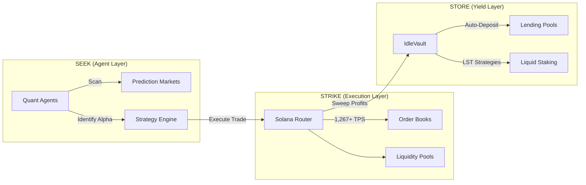

# Stratavault
> *Agentic Intelligence. Predictive Precision. DeFi Yield.*

## 📋 Overview

**Stratavault** is the first **Agent-First Asset Manager** built on Solana. It enables a new "Agentic Economy" where AI agents autonomously scan prediction markets for alpha ("Seek"), execute trades with millisecond precision ("Strike"), and automatically sweep profits into high-yield DeFi vaults ("Store").

Built for the 2026 Solana landscape, Stratavault leverages **Firedancer**-grade throughput to bridge the gap between speculative Prediction Markets (Polymarket, Drift) and stable DeFi Yield (Kamino, Sanctum).

## 📚 Documentation Suite

### Core Specification
- **[Identity & Vision](./PROJECT_IDENTITY.md)**: The "Seek, Strike, Store" thesis.
- **[Integration Roadmap](./INTEGRATION_ROADMAP.md)**: Phases 1-5 detailed plan.
- **[Architecture](./ARCHITECTURE_SAFE_AGENT.md)**: Safe Agent design patterns.
- Smart contract architecture
- Frontend architecture
- Oracle integration
- Testing strategy
- Deployment roadmap

### Detailed User Stories

#### 1. **Market Creator Workflows**
**[`MARKET_CREATOR_DETAILED_SPEC.md`](./MARKET_CREATOR_DETAILED_SPEC.md)**

Complete end-to-end workflow for market creators:
- ✅ portfolio investment / market creation process (10 phases).
- ✅ UI components and state transitions.
- ✅ Distribution chart builder.
- ✅ Oracle configuration.
- ✅ Economic parameters.
- ✅ Resolution mechanics.

**Key Sections:**
- Phase 1: Market Creation Initiation
- Phase 2: Event Definition & Configuration
- Phase 3: Probability Distribution Design
- Phase 4: Resolution & Oracle Configuration
- Phase 5: Economic Parameters
- Phase 6: Review & Deploy
- Phase 7: Wallet Transaction Flow
- Phase 8: Post-Creation Dashboard
- Phase 9: Market Resolution
- Phase 10: Post-Resolution

#### 2. **Market Participant Workflows**
**[`MARKET_PARTICIPANT_DETAILED_SPEC.md`](./MARKET_PARTICIPANT_DETAILED_SPEC.md)**

Complete trading and portfolio management experience:
- ✅ Market discovery and filtering
- ✅ Interactive distribution trading
- ✅ Multiple prediction input methods
- ✅ Position management
- ✅ AI-assisted trading
- ✅ Rewards claiming

**Key Sections:**
- Phase 1: Market Discovery & Browse
- Phase 2: Market Analysis & Detail View
- Phase 3: Wallet Transaction & Position Management
- Phase 4: Portfolio & Position Management
- Phase 5: AI-Assisted Trading
- Phase 6: Market Resolution & Claiming

### Technical Specifications

#### 3. **Mathematical Framework**
**[`MATHEMATICAL_FRAMEWORK.md`](./MATHEMATICAL_FRAMEWORK.md)**

Rigorous mathematical foundations:
- ✅ L² norm-based CFMM mechanics
- ✅ Gaussian distribution pricing
- ✅ Collateralization formulas
- ✅ Profit/loss calculations
- ✅ Liquidity provider economics
- ✅ Market scoring rules

**Key Formulas:**
```
‖f‖₂ = √(∫₋∞^∞ f(x)² dx) = k
φ(x; μ, σ) = (1/√(2πσ²)) · exp(-(x-μ)²/(2σ²))
Collateral = -min_x [g(x) - f(x)]
```

#### 4. **AI Agentic Workflows**
**[`AI_AGENTIC_WORKFLOWS.md`](./AI_AGENTIC_WORKFLOWS.md)**

Autonomous trading agent architecture:
- ✅ Multi-agent system design
- ✅ Market inefficiency detection
- ✅ Bayesian belief updating
- ✅ Portfolio risk management
- ✅ Automated market making
- ✅ ML prediction models

**Agent Types:**
- Data Ingestion Agent
- Market Analysis Agent
- Trading Execution Agent
- Risk Management Agent
- Liquidity Provision Agent
- Learning & Optimization Agent

#### 5. **Hybrid Order Book Mechanics**
**[`HYBRID_ORDER_BOOK.md`](./HYBRID_ORDER_BOOK.md)**

AMM + CLOB hybrid implementation:
- ✅ Order matching flow
- ✅ Order types (market, limit, stop-loss)
- ✅ Partial fill handling
- ✅ Fee structure (maker-taker)
- ✅ Solana optimizations
- ✅ State compression

## 🎯 Quick Start Guide

### For Product Managers
1. Start with [`solana-onchain-protocol.md`](./solana-onchain-protocol.md) for high-level overview
2. Review user stories in [`MARKET_CREATOR_DETAILED_SPEC.md`](./MARKET_CREATOR_DETAILED_SPEC.md)
3. Understand participant journey in [`MARKET_PARTICIPANT_DETAILED_SPEC.md`](./MARKET_PARTICIPANT_DETAILED_SPEC.md)

### For Developers
1. Review [`MATHEMATICAL_FRAMEWORK.md`](./MATHEMATICAL_FRAMEWORK.md) for core algorithms
2. Study smart contract architecture in [`solana-onchain-protocol.md`](./solana-onchain-protocol.md)
3. Implement order book from [`HYBRID_ORDER_BOOK.md`](./HYBRID_ORDER_BOOK.md)

### For UI/UX Designers
1. Review all UI components in [`MARKET_CREATOR_DETAILED_SPEC.md`](./MARKET_CREATOR_DETAILED_SPEC.md)
2. Study interaction patterns in [`MARKET_PARTICIPANT_DETAILED_SPEC.md`](./MARKET_PARTICIPANT_DETAILED_SPEC.md)
3. Reference Metaculus for distribution chart inspiration

### For Quants/Researchers
1. Deep dive into [`MATHEMATICAL_FRAMEWORK.md`](./MATHEMATICAL_FRAMEWORK.md)
2. Review Paradigm's Distribution Markets paper (linked in main spec)
3. Analyze [`AI_AGENTIC_WORKFLOWS.md`](./AI_AGENTIC_WORKFLOWS.md) for trading strategies

## 🏗️ System Architecture: Seek, Strike, Store



## 📊 Key Features

### Market Types
- **Distributional Markets**: Continuous probability distributions
- **Binary Markets**: Yes/No outcomes
- **Categorical Markets**: Multiple discrete outcomes

### Distribution Types
- Normal/Gaussian
- Log-normal
- Bimodal (multi-modal)
- Uniform
- Custom (free-form)

### Trading Mechanisms
- **AMM**: Constant liquidity via L² norm CFMM
- **CLOB**: Price discovery via limit order book
- **Hybrid**: Best execution across both

### Oracle Support
- Chainlink (crypto prices)
- Pyth Network (financial data)
- Switchboard (custom feeds)
- Manual resolution (creator/multi-sig/voting)

## 🔬 Research References

1. **Paradigm - Distribution Markets** (Dec 2024)
   - https://www.paradigm.xyz/2024/12/distribution-markets
   - Core mathematical framework

2. **Metaculus Platform**
   - https://www.metaculus.com
   - UX inspiration for distribution charts

3. **Hanson - Logarithmic Market Scoring Rules** (2003)
   - Alternative market maker mechanism

4. **Chen & Pennock - Bounded-Loss Market Makers** (2007)
   - LMSR foundations

## 🛠️ Technology Stack

### Smart Contracts
- **Language**: Rust
- **Framework**: Anchor
- **Blockchain**: Solana

### Frontend
- **Framework**: Next.js 14 (App Router)
- **Styling**: TailwindCSS + shadcn/ui
- **Charts**: D3.js / Recharts
- **State**: Zustand / Jotai
- **Wallet**: Solana Wallet Adapter

### Backend Services
- **Indexing**: Helius / QuickNode
- **Real-time**: WebSocket
- **Analytics**: Custom indexer

## 📈 Development Roadmap

### Phase 1: Seek (The Brain)
- [x] **Mathematical Framework**: L² Norm CFMM & Discretization.
- [ ] **Agent Ingestion**: Scrapers for Polymarket/Drift.

### Phase 2: Strike (The Muscle)
- [ ] **Solana Indexer**: High-performance log subscription.
- [ ] **Execution Router**: Optimizing for 150ms finality.

### Phase 3: Store (The Vault)
- [ ] **IdleVault Contracts**: Kamino & Sanctum Adapters.
- [ ] **Yield Automation**: "Profit-to-Yield" sweep triggers.

### Phase 4: Control (The Bridge)
- [ ] **Generative UI**: "Copilot Kit" for User-Agent interaction.
- [ ] **Dashboard**: Visualizing the entire capital lifecycle.

## 🔐 Security Considerations

- Smart contract audit required before mainnet
- Economic model peer review
- Oracle manipulation testing
- Stress testing with simulated volume
- Bug bounty program

## 📝 Contributing

When updating specifications:
1. Maintain consistency across all documents
2. Update version numbers and dates
3. Cross-reference related sections
4. Include code examples where applicable
5. Keep mathematical notation consistent

## 📞 Contact & Support

For questions about these specifications:
- Review the relevant document first
- Check cross-references in main spec
- Consult external research papers linked

## 📄 License

These specifications are part of the Solana Colossum Hackathon project.

---

**Last Updated**: October 10, 2025  
**Version**: 1.0  
**Status**: Complete - Ready for Implementation
