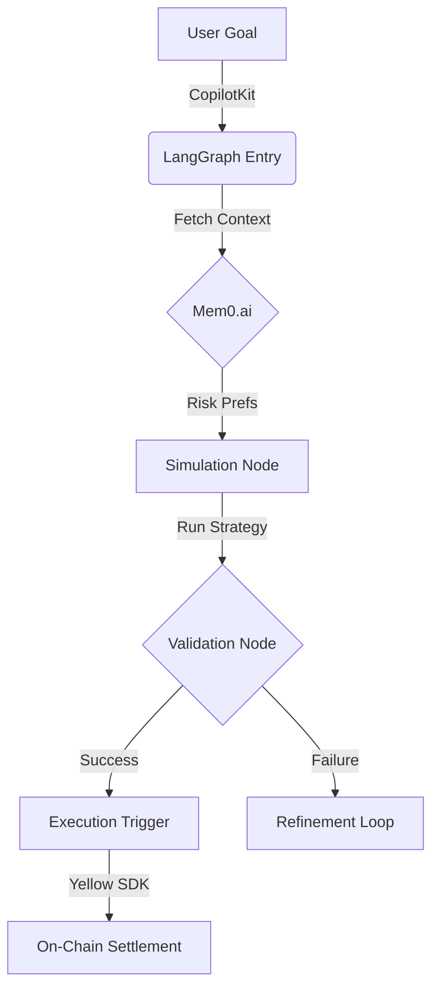
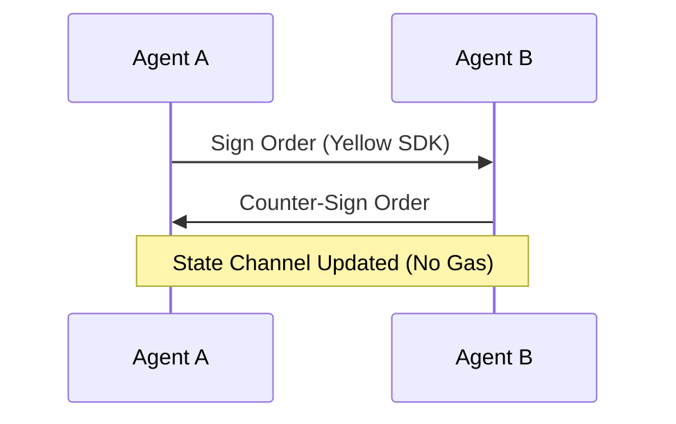

# AI Agentic Workflows (EthGlobal HackMoney Edition)

## Stack Pivot: Yellow Network + Uniswap V4
This architecture leverages **Yellow Network** for instant, gasless off-chain signaling and **Uniswap V4 Hooks** for programmable on-chain liquidity management.

## 1. Agent Architecture (LangGraph + CopilotKit)

This system uses a **LangGraph** state machine to orchestrate the lifecycle of an agent from "Seek" (Simulation) to "Strike" (Execution), powered by **Mem0.ai** for personalized user context.

### Technology Stack
- **Orchestration**: `LangGraph` (Stateful multi-agent workflows).
- **UI Integration**: `CopilotKit` (Human-in-the-loop approval).
- **Memory**: `Mem0.ai` (Vector storage for User Risk Profiles & Historical Strategies).
- **Data**: `Perplexity Sonar` (Real-time market context).

### Workflow: The "Simulation-to-Execution" Pipeline

### Node Logic

1.  **Context Node (Mem0)**:
    - *Input*: User ID.
    - *Action*: Queries Mem0 for "Conservative vs Degen" risk profile.
    - *Output*: `risk_score` (0.1 - 1.0).

2.  **Simulation Node (BFW Optimization)**:
    - *Input*: Market Data + Risk Score.
    - *Action*: Runs the **Barrier Frank-Wolfe** algorithm (see `AGENTS.md`) to simulate PnL.
    - *Output*: `predicted_pnl`, `confidence_interval`.

3.  **Human-in-the-Loop (CopilotKit)**:
    - *Trigger*: If `confidence < 0.9` but `pnl > 10%`.
    - *UI*: Pops a "Review Strategy" card in the frontend.
    - *Action*: User approves signature via Copilot interface.

---

## 2. High-Frequency "Seek & Strike" Loop

### Phase 1: Off-Chain Discovery (Yellow)
Agents negotiate trade intents off-chain to avoid gas.

### Phase 2: On-Chain Settlement (Yellow -> Uniswap V4)
When a profitable batch is accumulated, agents settle to Uniswap V4.
1. **Close**: Agent calls `Yellow.settleSession(signedSnapshot)` to the Settlement Contract.
2. **Flash Accounting**: Settlement Contract receives net assets.
3. **Swap**: Contract atomically swaps net positions into Uniswap V4 pools for long-term yield.

---

## 3. Reference Implementation: "Snitch Liquidity"
**Bot Strategy**:
- **Ingest**: Sniff mempool for large swaps.
- **Reason**: "If huge buy on Uniswap V3, price will lag on V4."
- **Act (Yellow)**: Instantly hedge exposure in a Yellow channel with a market maker.
- **Act (V4)**: Adjust V4 Hook dynamic fee to capture volatility (`DYNAMIC_FEE_FLAG`).

## 4. Technical Integration
- **SDK**: `@yellow-network/nitrolite-sdk`
- **V4 SDK**: `@uniswap/v4-sdk`
- **Signatures**: EIP-712 structured data for Intents.