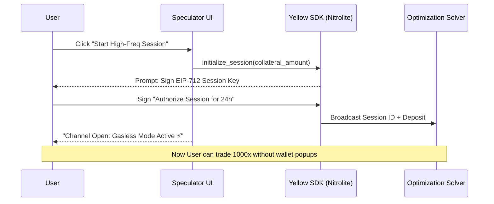

# Market Participant - Detailed User Stories & UI Flow (EthGlobal HackMoney)

## 1. Zero-Gas "Session Handshake" (Yellow Network)
This flow replaces the traditional "Sign every trade" model with a single session signature.

### Flow Diagram

### UI Components

#### A. Connection Modal ("The Handshake")
- **Trigger**: "Connect Session" button in top-right.
- **State 1: Configuration**
  - **Collateral Slider**: "Deposit 0.1 - 10 ETH" (Locked for settlement).
  - **Duration**: "Session valid for: [ 4 Hours ]".
  - **Agent Limit**: "Max drawdown: 5%".
- **State 2: Authorization**
  - Visual: Animated "Handshake" icon.
  - Action: Wallet signature request (EIP-712).
  - feedback: "Creating secure state channel...".
- **State 3: Active**
  - "Session Live 🟢".
  - "Gas Saved: $0.00".
  - "Latency: 45ms".

#### B. The "Disconnect" (Settlement)
- **Trigger**: "End Session" or "Withdraw" button.
- **Action**: 
  - Submits `closeSession(finalState)` to Ethereum.
  - Returns net profit/loss to user's EOA.
  - Visual: "Settling on-chain... (Transaction Pending)".

---

## 2. Hook Strategy Dashboard (Uniswap V4)

### Overview
Users don't just "swap"; they "delegate liquidity" to Hook Agents.

### UI Components

#### A. Strategy Selection ("The Agent Store")
- **Layout**: Grid of available Hook Strategies.
- **Card Content**:
  - **Title**: "HFT Arb: Yellow <-> V4".
  - **Badge**: "Uniswap V4 Hook".
  - **APY**: "24% (Est.)".
  - **Risk**: "Medium (Impermanent Loss)".
  - **Action**: "Deploy Liquidity".

#### B. Position Performance View
Real-time monitoring of the active Hook.

| Metric | Value | Description |
| :--- | :--- | :--- |
| **ROI** | `+4.2%` | Net return on deposited liquidity. |
| **Fees Earned** | `$124.50` | Dynamic fees captured by the Hook. |
| **Divergence** | `0.03%` | Spread between Yellow (Off-chain) and V4 (On-chain). |
| **Gas Saved** | `$450` | Cost reduction vs. standard swaps. |

**Charts:**
- **Area Chart**: "TVL vs. Fees Earned".
- **Heatmap**: "Liquidity Concentration" (Tick ranges managed by the Hook).

#### C. Control Panel ("Agent Governance")
- **Pause/Resume**: Stop the agent without withdrawing liquidity.
- **Rebalance Config**:
  - "Trigger Rebalance when Price moves > [ 0.5% ]".
  - "Max Gas Price: [ 50 ] gwei".

---

## 3. Revised Navigation Structure
1.  **Dashboard**: Active Sessions & Hook Performance.
2.  **Markets (Seek)**: Browse Prediction Markets & Arb Opportunities.
3.  **Strategies (Strike)**: Configure Logic/Optimization Agents.
4.  **Vaults (Store)**: Yield management via Uniswap V4.

